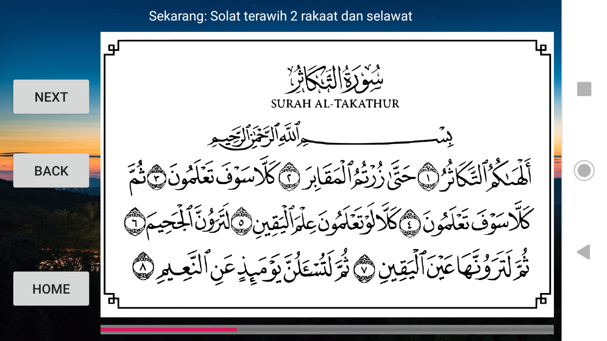
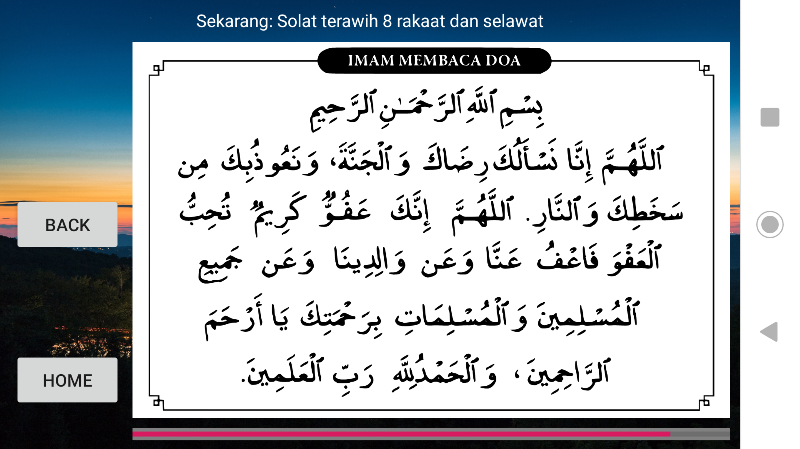

# Terawih Sendirian

## Aims
For muslims who are unable to go to musolla/masjid due to various reason.
This app will act as a guide in performing Solah Terawih.

## Idea
I had difficulty to do Solat Terawih on my own because of my memory weakness.
Many times i forgot how many rakaat have i prayed.
So i created this app as a guide.

## Preview




# Pre-compiled APK

Install mengunakan file 
```
Terawih_Sendirian.apk
```

# Help needed

To those senior programmer, feel free to send pull request. 
Looking at the code, i'm sure you'll notice lots of bugs.

